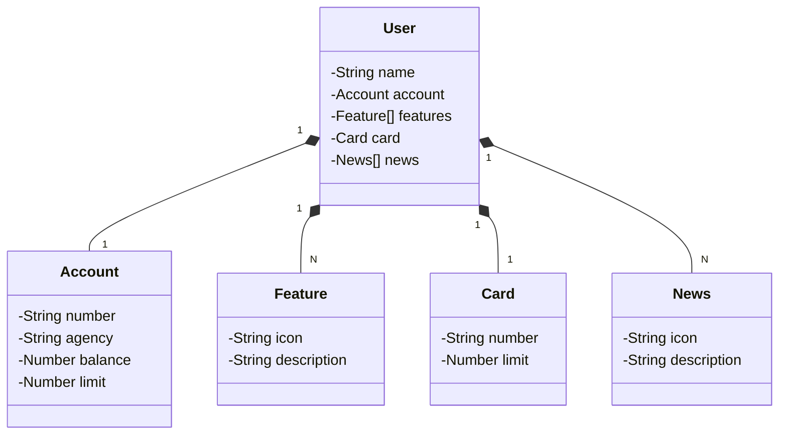

# Java AI Powered Bootcamp 2024

RESTful API built in Java 17 with Spring Boot 3 developed in the final challenge of the [Java AI Powered Bootcamp](https://www.dio.me/bootcamp/coding-future-tonnie-java-ai-powered).

## Technologies
- Java 17
- Spring Boot 3
- Spring Data JPA
- OpenAPI (Swagger)

## Class Diagram (API Domain)

